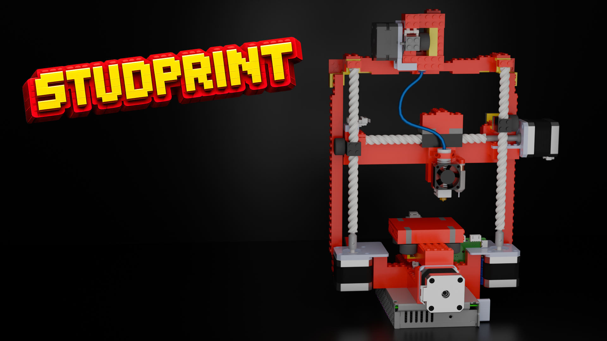

## 

A standard I3 style bedslinger...but with a twist! The frame, motion system, and extruder is made out of 91%[^1] classic LEGO bricks.

## About

This project started in response to a Hackclub YSWS called [Infill](https://infill.hackclub.com). The pitch was to make a 3D printer under $350 with a twist. Having grown up on LEGO, I decided to just make my entire printer out of it!

To make this printer a one-of-a-kind, I decided to take it a step further and not only build it out of LEGO, but only use classical LEGO bricks[^2] wherever I could. As you can expect, some parts of it — notably the parts that make the printer move and mounts for the steppers, electronics, etc — cannot be made with this limitation (with some exceptions). I will admit, there may be some parts of this project that I "cheated" and used 3D prints instead of a complicated LEGO setup, but due to lack of time, I had to make compromises.

[^1]: Calculated by taking the amount of LEGO components and dividing by the amount of total components reported in the BOM within the Solidworks drawings

[^2]: I defined classical LEGO as the bricks and parts that interface with them (aka no Technique)

## Cost

The cost for LEGO will vary depending on local availability. The cost you see in the BOM is how much I ended up needing. Being fortunate enough to be raised with lots of LEGO, I only needed a handful of parts. However, even with the parts, I believe you could get this printer without breaking the bank. Below is the a screenshot of the BOM. Luckily, not many parts are needed!

## License

Studprint is licensed under the CERN Open Hardware Licence. See the full license text in LICENSE.
