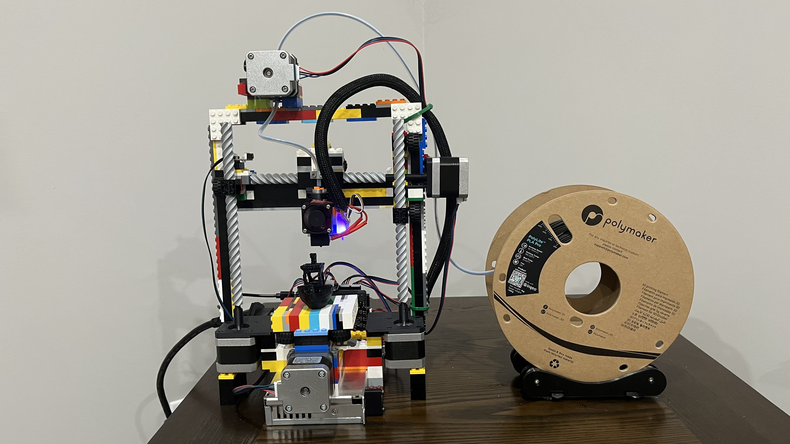
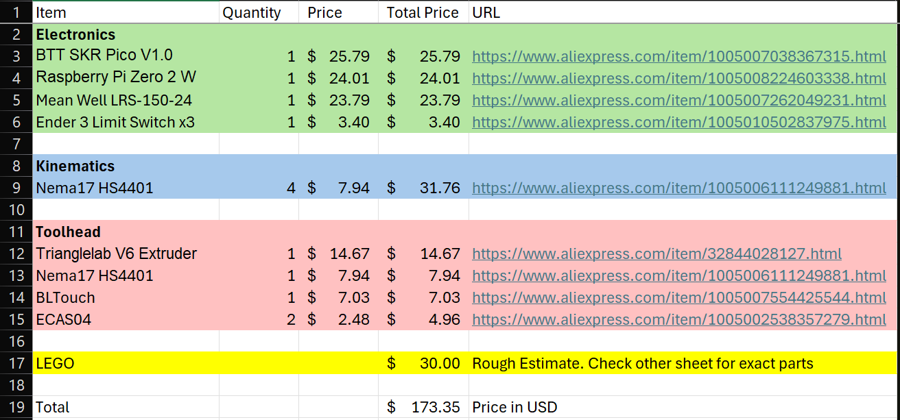

## 

**A standard bedslinger...but with a twist! The frame, motion system, and extruder are made out of 92%[^1] LEGO bricks.**

## About

This project started as a response to a Hack Club YSWS called [Infill](https://infill.hackclub.com). The challenge was to build a 3D printer for under $350, with a twist. Having grown up with LEGO, I decided to make the entire printer out of it.

To make this printer truly one of a kind, I took it a step further: not only would it be built from LEGO, but I would also use only classical LEGO bricks[^2] wherever possible. As you might expect, some parts, especially the custom mounts for steppers, electronics, and other hardware, can't realistically be made under that limitation.

[^1]: Calculated by taking the number of LEGO components and dividing by the total number of components reported in the BOM within the SolidWorks drawings

[^2]: I defined classical LEGO as the bricks and parts that interface with them (i.e., no Technic)

## Cost

LEGO cost will vary depending on local availability, and the BOM cost is only a rough estimate. Prices in the sheet reflect the time it was created and are not guaranteed to stay the same. Some parts may also go out of stock, since this BOM will not be actively maintained.

## License

StudPrint is licensed under the CERN Open Hardware Licence. See the full license text in LICENSE.
